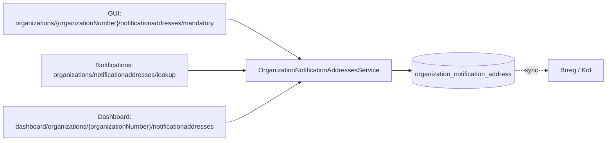
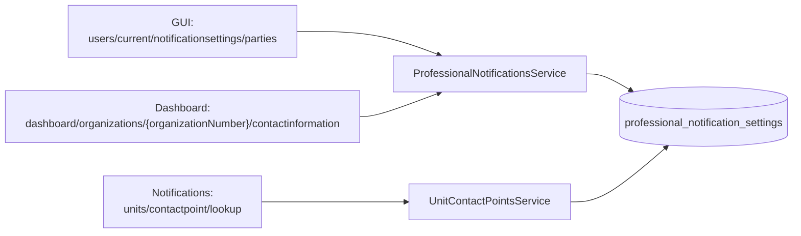
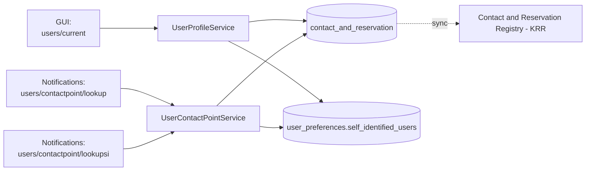

# Profile — Data Access Map

> Maps which controller endpoints access which database schemas/tables, through which services, grouped by dataset. Update this file whenever an endpoint, service, or schema mapping changes.

---

## Dataset: Organization Notification Addresses

- **Schema:** `organization_notification_address`
- **Service:** `OrganizationNotificationAddressesService`
- **Synced externally:** Yes → Brønnøysundregistrene (Brreg / Kof)

| Context | Endpoint |
|---|---|
| GUI | `organizations/{organizationNumber}/notificationaddresses/mandatory` |
| Notifications | `organizations/notificationaddresses/lookup` |
| Dashboard | `dashboard/organizations/{organizationNumber}/notificationaddresses` |

---

## Dataset: Professional Notification Settings

- **Schema:** `professional_notification_settings`
- **Services:** `ProfessionalNotificationsService`, `UnitContactPointsService`
- **Synced externally:** No

| Context | Endpoint | Service |
|---|---|---|
| GUI | `users/current/notificationsettings/parties` | ProfessionalNotificationsService |
| Notifications | `units/contactpoint/lookup` | UnitContactPointsService |
| Dashboard | `dashboard/organizations/{organizationNumber}/contactinformation` | ProfessionalNotificationsService |

---

## Dataset: Private Notification Settings

- **Schemas:** `contact_and_reservation`, `user_preferences` (table: `self_identified_users`)
- **Services:** `UserProfileService`, `UserContactPointService`
- **Synced externally:** `contact_and_reservation` → Yes, Contact and Reservation Registry (KRR). `user_preferences` → No.

| Context | Endpoint | Service |
|---|---|---|
| GUI | `users/current` | UserProfileService |
| Notifications | `users/contactpoint/lookup` | UserContactPointService |
| Notifications | `users/contactpoint/lookupsi` | UserContactPointService |

---

## Full Matrix (all datasets)

| Dataset | Context | Endpoint | Service | Schema/Table | Synced to |
|---|---|---|---|---|---|
| Org Notification Addresses | GUI | `.../notificationaddresses/mandatory` | OrganizationNotificationAddressesService | organization_notification_address | Brreg (Kof) |
| Org Notification Addresses | Notifications | `.../notificationaddresses/lookup` | OrganizationNotificationAddressesService | organization_notification_address | Brreg (Kof) |
| Org Notification Addresses | Dashboard | `.../notificationaddresses` | OrganizationNotificationAddressesService | organization_notification_address | Brreg (Kof) |
| Professional Notification Settings | GUI | `.../notificationsettings/parties` | ProfessionalNotificationsService | professional_notification_settings | — |
| Professional Notification Settings | Notifications | `units/contactpoint/lookup` | UnitContactPointsService | professional_notification_settings | — |
| Professional Notification Settings | Dashboard | `.../contactinformation` | ProfessionalNotificationsService | professional_notification_settings | — |
| Private Notification Settings | GUI | `users/current` | UserProfileService | contact_and_reservation, user_preferences.self_identified_users | KRR (contact_and_reservation only) |
| Private Notification Settings | Notifications | `users/contactpoint/lookup` | UserContactPointService | contact_and_reservation| KRR (contact_and_reservation only) |
| Private Notification Settings | Notifications | `users/contactpoint/lookupsi` | UserContactPointService |  user_preferences.self_identified_users | — |

---

### Maintaining this file

When adding, removing, or changing an endpoint/service/schema mapping: update the relevant dataset section's table and Mermaid diagram, then update the row(s) in the Full Matrix. Keep the dataset grouping — it's meant to answer "what does dataset X touch" and "what does endpoint Y touch" at a glance, without needing to trace code.
